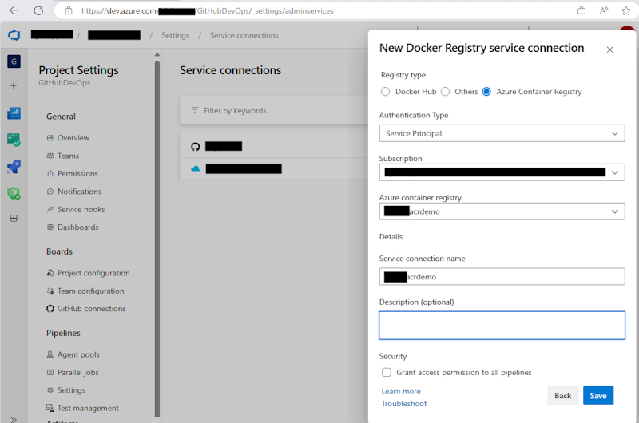

# Azure DevOps Deployment Template Notes

## 1. Azure DevOps Template Definitions

These are the main pipelines defined for this project:

- **deploy-kube-pipeline.yml:** Deploys the AKS quickstart YAML file to create an AKS cluster for this test -- not needed if you already have an AKS cluster
- **deploy-container-registry-pipeline.yml:** Deploys the main-containerregistry.bicep template to create an Azure Container Registry (ACR) for the AKS deploys - not needed if you already have an ACR
- **deploy-infra-pipeline.yml:** Builds and deploys all of the resources for this app defined in the main-infra.bicep file. Can also optionally deploys the alerts and dashboard
- **deploy-alerts-pipeline.yml:** Deploys alerts for the AKS clusterthe variable group
- **deploy-dashboard-pipeline.yml:** Deploys a sample dashboard for the AKS cluster

Note: The alerts and dashboard pipelines are expecting the cluster name to be set in the variable group before they can run.

These YML files were designed to run as multi-stage environment deploys (i.e. DEV/QA/PROD). Each Azure DevOps environments can have permissions and approvals defined. For example, DEV can be published upon change, and QA/PROD environments can require an approval before any changes are made. If you don't supply environments, it will assume that it is a single environment named 'DEMO'.

---

## 2. Setup and Deploy Steps

To deploy this application, execute the following steps:

- [Create an Azure DevOps Service Connection](https://docs.luppes.com/CreateServiceConnections/)

- [Create Azure DevOps Environments](https://docs.luppes.com/CreateDevOpsEnvironments/)

- Create Azure DevOps Variable Groups -- see step 3 for details

- [Create Azure DevOps Pipelines](https://docs.luppes.com/CreateNewPipeline/)

<!-- 
You may also need to:

- Run the deploy-(kube/container-registry/infra)-pipeline.yml pipelines to deploy needed Azure Resources.

- Create a Docker Service Connection in the Project Settings

- Add the Docker Service Connection and ACR User/Password to the Variable Group
-->

---

## 3. Creating the Variable Group "AKSDemo"

### 3.1. Create the Initial Variable Group

Create a variable group with these values before running the aca-infra-pipeline.yml by customizing and running this command in the Azure Cloud Shell:

``` bash
   az login

   az pipelines variable-group create 
     --organization=https://dev.azure.com/<yourAzDOOrg>/ 
     --project='<yourAzDOProject>' 
     --name AKSDemo 
     --variables 
         resourceGroupPrefix=rg_aks
         appName=xxx-aks
         actionGroupName=aksAlertGrp1
         actionGroupShortName=aksalertgrp1
         location=eastus
         notificationEmail=youremail@yourdomain.com
         serviceConnectionName=<yourAzureServiceConnectionName>
         subscriptionId=<yourSubscriptionId>
         subscriptionName=<yourSubscriptionName>
```

<!--
### 3.2. Create Docker Service Connection (Optional)

AFTER creating the Azure Container Registry, go into the Project Settings and create a Docker Service Connection that will allow pipelines to connect to the Container Registry.



### 3.3. Update the Variable Group (Optional)

After creating the Docker Service Connection, add these four variables in the variable group.  

Find the acrAdminUserName and acrAdminPassword by navigating to the Container Registry in the portal, going to the Access keys tab, and (if the Admin User option is enabled) the password should be visible on that page.

Make these entries in the Variable Group:

``` bash
  dockerRegistryConnectionName=<nameOfTheDockerServiceConnection>
  acrName=<containerRegistryName>
  acrAdminUserName=<fromContainerRegistryPage>
  acrAdminPassword=<fromContainerRegistryPage>
```
-->