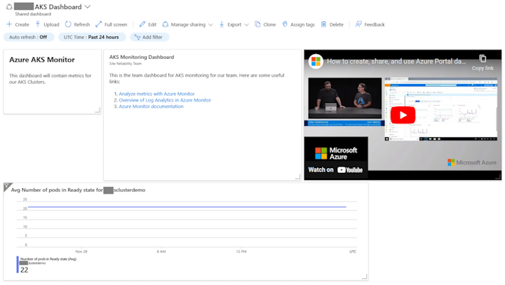

# Create Alerts Demo

## Overview

This project is a demonstration of how to create queries and alerts in a Log Analytics workspace.

The bicep and pipeline in this project will generate:

- A Log Analytics workspace
- An Action Group to send alerts to
- Some generic Log Analytics queries
- Some alerts for an array of AKS Clusters
- Some alerts for an array of AKS Containers
- Some alerts for an array of AKS Pods
- A sample Dashboard with a couple of modules

### Example Resources Created

### Example Dashboard

### Contents of Query Pack

Name:

- Pod Log Messages: store-front-kr4xx
- Container Log Messages: bogus-front
- Container Log Messages: store-front
- Pod Log Messages: bogus-store-kr4xx

## Prerequisites

The pipeline is dependent on the variable group AKSDemo, which is defined in this [readme](.azdo/readme.md) project, which needs to be linked to the pipelines.
