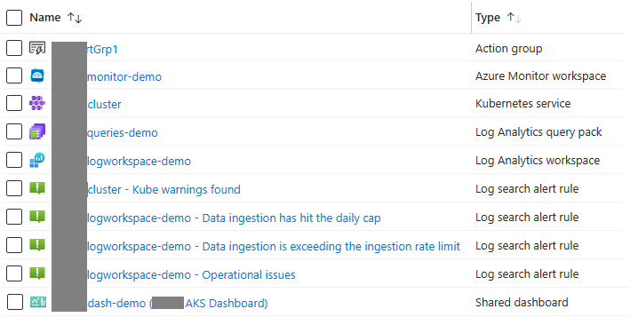

# Create Alerts Demo

## Overview

This project is a demonstration of how to create queries and alerts in a Log Analytics workspace.

The bicep and pipeline in this project will generate:

- A Log Analytics workspace
- An Action Group to send alerts to
- Some generic Log Analytics queries
- Some alerts for an array of AKS Clusters
- Some alerts for an array of AKS Containers
- Some alerts for an array of AKS Pods

### Example Resources Created

### Contents of Query Pack lll-aks-queries-demo

Display Name                        | Name
----------------------------------- | ------------------------------------
Pod Log Messages: store-front-kr4xx | a29f7776-7381-5f99-bc9a-978916c5b8b5
Container Log Messages: bogus-front | 734c881f-43c0-5dec-b0d5-7aea4ff933f2
Container Log Messages: store-front | 5ed594b8-3969-5f48-bf35-ed05950eab46
Pod Log Messages: bogus-store-kr4xx | ca4563d6-7f49-5605-afbc-e9045197a679

## Prerequisites

The pipeline is dependent on the variable group AKSDemo, which is defined in this [readme](.azdo/readme.md) project, which needs to be linked to the pipelines.
